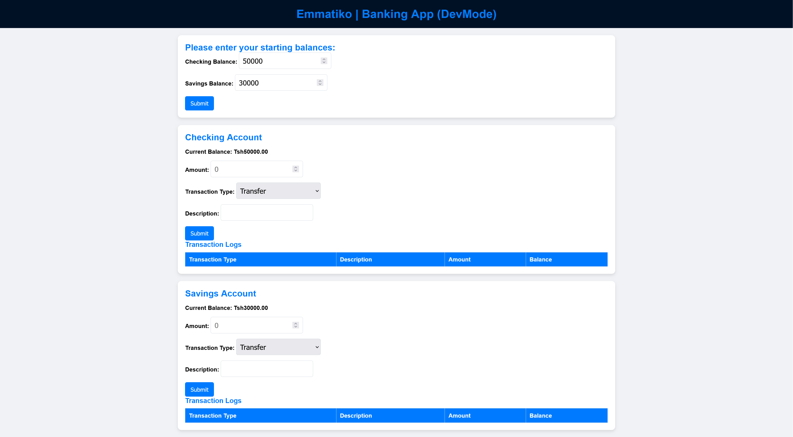

# Minimal Banking App

**A web application for simple transfer of credit between two accounts**  


---

## 🌟 Features  
- **Credit transfer**: Users get two accounts to visualise transfer of credits
- **Simple aesthetics**: Minimal noises in the web page makes the user more focused on performing a calculation.  
- **Responsive Design**: Works seamlessly across devices and screen sizes.  
- **Logging system**: All activities are stored in tabulated logs
---

## 🚀 How to Use  

1. **Clone the Repository**:  
   ```bash  
   git clone https://github.com/emma7iko/minimal-banking-app.git  
   ```  

2. **Navigate to the Project Directory**:  
   ```bash  
   cd minimal-banking-app
   ```  

3. **Open the App in Your Browser**:  
   Simply open `indext.html` in your browser to start using the app.   

---

## 🛠️ Built With  

| **Technology**      | **Logo**                                  |  
|----------------------|-------------------------------------------|  
| HTML5               |  |  
| CSS3                |  |  
| JavaScript          |  |  
---
